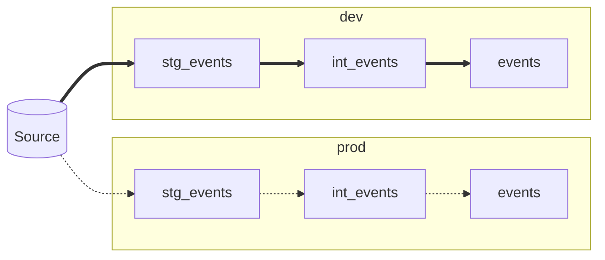
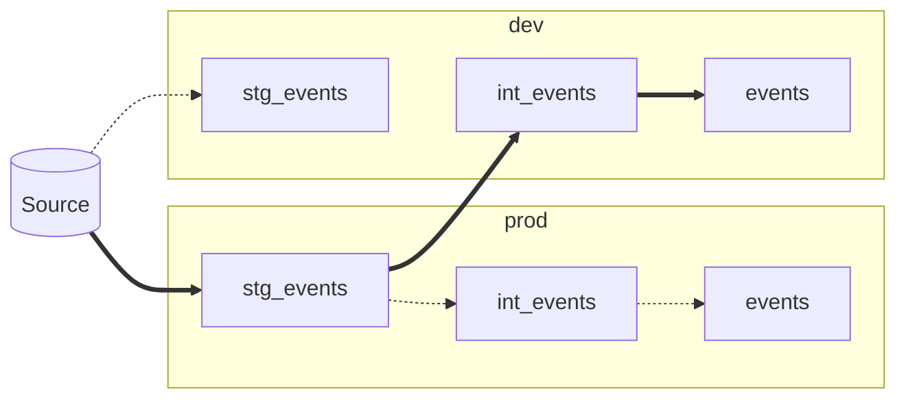

# What is upstream-prod?

`upstream-prod` is a dbt package for easily using production data in a development environment. It's a hands-off alternative to the [defer flag](https://docs.getdbt.com/reference/node-selection/defer) - only without the need to find and download a production manifest - and was inspired by [similar work by Monzo](https://monzo.com/blog/2021/10/14/an-introduction-to-monzos-data-stack).

### Why do I need it?

In a typical project, prod and dev models are materialised in [separate environments](https://docs.getdbt.com/docs/core/dbt-core-environments). Although this ensures end users are unaffected by ongoing development, there's a significant downside: the isolation means that each environment needs a complete, up-to-date copy of _every_ model. This can be challenging for complex projects or long-running models, and out-of-date data can cause frustrating errors.

`upstream-prod` solves this by intelligently redirecting `ref`s to prod outputs. It is highly adaptable and can be used whether your environments are in separate schemas, databases, or a combination of both. On most warehouses it can even compare dev and prod outputs and use the most recently-updated relation.

### ⚠️ Breaking changes in version `0.9.0`

If upgrading from an earlier version:
- Your `ref` macro *must* be updated by copying the relevant example from the setup guide below.
- Projects using the deprecated `upstream_prod_database_replace` variable should use `upstream_prod_env_dbs` instead.

## Setup

> ℹ️ If you need help setting up the package, please create an issue or tag / DM @LewisDavies on dbt's Slack.

The package relies on a few variables that indicate where prod data is avaiable. The exact requirements depend on your setup; use the questions below to find the correct variables for your project. 

#### 1. Does your project have a custom schema macro?

If you aren't sure, check your `macros` directory for a macro called `generate_schema_name`. The exact filename may differ - [dbt's docs](https://docs.getdbt.com/docs/build/custom-schemas#a-built-in-alternative-pattern-for-generating-schema-names) call it `get_custom_schema.sql` - so you may need to check the file contents.

#### 2. Do your dev & prod environments use the same database?
Your platform may use a different term, such as _catalog_ on Databricks or _project_ on BigQuery.

#### 3. Choose the appropriate setup

|                                   | Custom schema macro | No custom schema macro |
|-----------------------------------|---------------------|------------------------|
| Dev & prod in same database       | Setup A             | Setup B                |
| Dev & prod in different databases | Setup C             | Setup D                |


<!-- START COLLAPSIBLE SECTIONS -->

<!-- A: custom macro & same database -->
<details><summary>Setup A</summary>
<br/>

Your custom schema macro needs two small tweaks to work with the package. As an example, the macro below shows how to adapt the [built-in `generate_schema_name_for_env` macro](https://github.com/dbt-labs/dbt-adapters/blob/6e765f58d1a15f7fcc15e504916543bd55bd62b7/dbt/include/global_project/macros/get_custom_name/get_custom_schema.sql#L47-L60):

```sql
-- 1. Add an is_upstream_prod parameter that defaults to False


    
    -- 2. In the clause that generates your prod schema names, add a check that the value is True
    --    **Make sure to enclose the or condition in brackets**
    

        {{ custom_schema_name | trim }}

    

        {{ default_schema }}

    


```

<br/>

Add the values below to the `vars` section of `dbt_project.yml`. Some optional variables are included to improve your experience:
- `upstream_prod_fallback` tells the package to return your dev relation if the prod version can't be found. This is very useful when creating multiple models at the same time.
- `upstream_prod_prefer_recent` compares when the prod and dev relations were last modified and returns the most recent. **This is only available on Snowflake, Databricks & BigQuery.**
- `upstream_prod_disabled_targets` is used to bypass the package in certain environments. **It is highly recommended to disable the package for prod runs**.

```yml
# dbt_project.yml
vars:
  # Required
  upstream_prod_env_schemas: true
  # Optional, but recommended
  upstream_prod_fallback: true
  upstream_prod_prefer_recent: true
  upstream_prod_disabled_targets:
    - prod
```
</details>

<!-- B: no custom macro & same database -->
<details><summary>Setup B</summary>
<br/>

Add the values below to the `vars` section of `dbt_project.yml`. Some optional variables are included to improve your experience:
- `upstream_prod_fallback` tells the package to return your dev relation if the prod version can't be found. This is very useful when creating multiple models at the same time.
- `upstream_prod_prefer_recent` compares when the prod and dev relations were last modified and returns the most recent. **This is only available on Snowflake, Databricks & BigQuery.**
- `upstream_prod_disabled_targets` is used to bypass the package in certain environments. **It is highly recommended to disable the package for prod runs**.

```yml
# dbt_project.yml
vars:
  # Required
  upstream_prod_schema: <prod_schema_name/prefix>
  # Optional, but recommended
  upstream_prod_fallback: true
  upstream_prod_prefer_recent: true
  upstream_prod_disabled_targets:
    - prod
```
</details>

<!-- C: custom macro & different databases -->
<details><summary>Setup C</summary>
<br/>

Your custom schema macro needs two small tweaks to work with the package. As an example, the macro below shows how to adapt the [built-in `generate_schema_name_for_env` macro](https://github.com/dbt-labs/dbt-adapters/blob/6e765f58d1a15f7fcc15e504916543bd55bd62b7/dbt/include/global_project/macros/get_custom_name/get_custom_schema.sql#L47-L60):

```sql
-- 1. Add an is_upstream_prod parameter that defaults to False


    
    -- 2. In the clause that generates your prod schema names, add a check that the value is True
    --    **Make sure to enclose the or condition in brackets**
    

        {{ custom_schema_name | trim }}

    

        {{ default_schema }}

    


```

<br/>

Add the values below to the `vars` section of `dbt_project.yml`. Some optional variables are included to improve your experience:
- `upstream_prod_fallback` tells the package to return your dev relation if the prod version can't be found. This is very useful when creating multiple models at the same time.
- `upstream_prod_prefer_recent` compares when the prod and dev relations were last modified and returns the most recent. **This is only available on Snowflake, Databricks & BigQuery.**
- `upstream_prod_disabled_targets` is used to bypass the package in certain environments. **It is highly recommended to disable the package for prod runs**.

```yml
# dbt_project.yml
vars:
  # Required
  upstream_prod_database: <prod_database_name>
  upstream_prod_env_schemas: true
  # Optional, but recommended
  upstream_prod_fallback: true
  upstream_prod_prefer_recent: true
  upstream_prod_disabled_targets:
    - prod
```

<details><summary><b>Using a custom database macro?</b></summary>
<br/>

There are two more steps if your project has a custom `generate_database_name` macro.

First, add `upstream_prod_env_dbs: true` to `dbt_project.yml`.

Then update your custom database macro in exactly the same way as your schema macro. For example:

```sql
-- 1. Add an is_upstream_prod parameter that defaults to False


    
    -- 2. In the clause that generates your prod database names, add a check that the value is True
    --    **Make sure to enclose the or condition in brackets**
    

        {{ custom_database_name | trim }}

    

        {{ default_database }}

    


```

</details>

</details>

<!-- D: no custom macro & different databases -->
<details><summary>Setup D</summary>
<br/>

Add the values below to the `vars` section of `dbt_project.yml`. Some optional variables are included to improve your experience:
- `upstream_prod_fallback` tells the package to return your dev relation if the prod version can't be found. This is very useful when creating multiple models at the same time.
- `upstream_prod_prefer_recent` compares when the prod and dev relations were last modified and returns the most recent. **This is only available on Snowflake, Databricks & BigQuery.**
- `upstream_prod_disabled_targets` is used to bypass the package in certain environments. **It is highly recommended to disable the package for prod runs**.

```yml
# dbt_project.yml
vars:
  # Required
  upstream_prod_database: <prod_database_name>
  upstream_prod_schema: <prod_schema_name/prefix>
  # Optional, but recommended
  upstream_prod_fallback: true
  upstream_prod_prefer_recent: true
  upstream_prod_disabled_targets:
    - prod
```

<details><summary><b>Using a custom database macro?</b></summary>
<br/>

There are two more steps if your project has a custom `generate_database_name` macro.

First, add `upstream_prod_env_dbs: true` to `dbt_project.yml`.

Your custom database macro now needs two small tweaks to work with the package, as shown in the example below:

```sql
-- 1. Add an is_upstream_prod parameter that defaults to False


    
    -- 2. In the clause that generates your prod database names, add a check that the value is True
    --    **Make sure to enclose the or condition in brackets**
    

        {{ custom_database_name | trim }}

    

        {{ default_database }}

    


```

</details>

</details>
<!-- END COLLAPSIBLE SECTIONS -->

### 4. Create a custom `ref()` macro

In your `macros` directory, create a file called `ref.sql` with the following contents:
```sql


    


```

Alternatively, you can find any instances of `{{ ref() }}` in your project and replace them with `{{ upstream_prod.ref() }}`. This is suitable for testing the package but is not recommended for general use.

## How it works

Assume your project has an `events` model that depends on intermediate and staging layers. The simplified DAGs looks like this:



You want to change `int_events`, so you need a copy of `stg_events` in dev. This could be expensive and time-consuming to create from scratch, and it could slow down your development process considerably. Perhaps this model already exists from previous work, but is it up-to-date? If the model definition or underlying data has changed, your dev model may break in prod.

`upstream-prod` sovles this problem by intelligently redirecting `ref`s based on the selected models for the current run. Running `dbt build -s int_events+` would:

1. Create `dev.int_events` using data from `prod.stg_events`
2. Create `dev.events` on top of `dev.int_events`, since the package recognises that `int_events` has been selected
3. Run tests against `dev.int_events` and `dev.events`

Now that your dev models are using prod data, you DAG would look like this:


## Compatibility
`upstream-prod` is built and tested on Snowflake. Based on my experience and user reports, it is known to work on:
- Snowflake
- Databricks
- BigQuery
- Redshift (you may need [RA3 nodes](https://aws.amazon.com/redshift/features/ra3/) for cross-database queries)
- Azure Synapse

It should also work with community-supported adapters that specify a target database or schema in `profiles.yml`.
